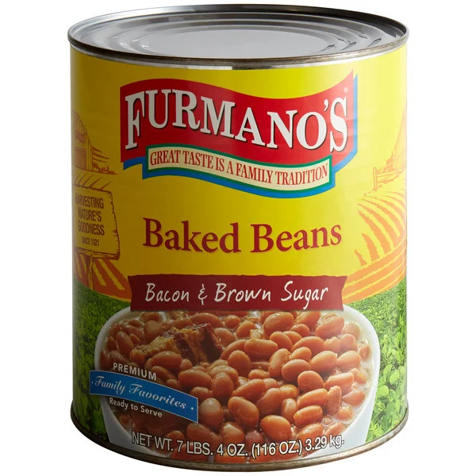
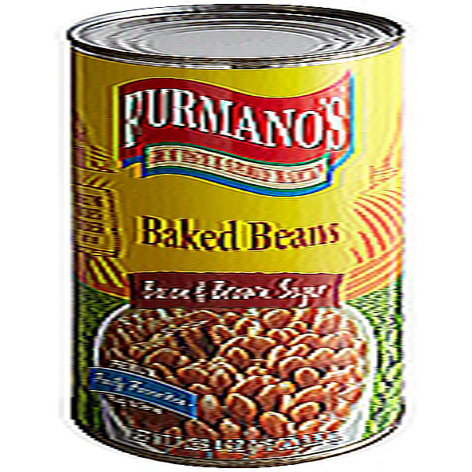
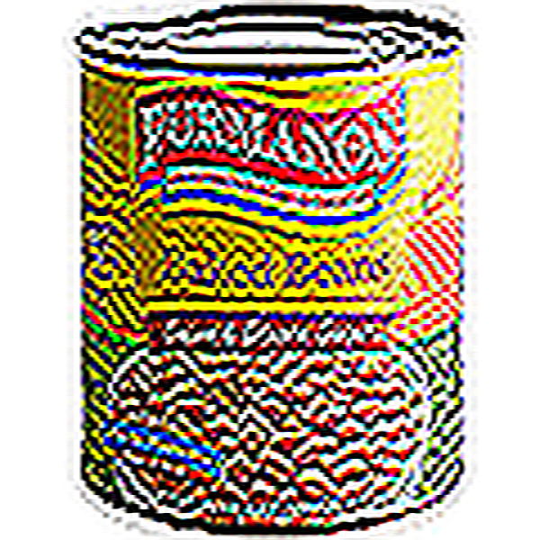
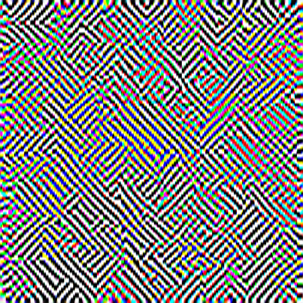

# flash fry
Python script to absolutely destroy the quality of an image. Have fun kids.
   

### Control Image (Nothing run yet)

  

### Run with three iterations
### `python flashfry.py "example_image.png" 3`

  

### Run with ten iterations
### `python flashfry.py "example_image.png" 10`

  

### Run with one hundred iterations
### `python flashfry.py "example_image.png" 100`

  