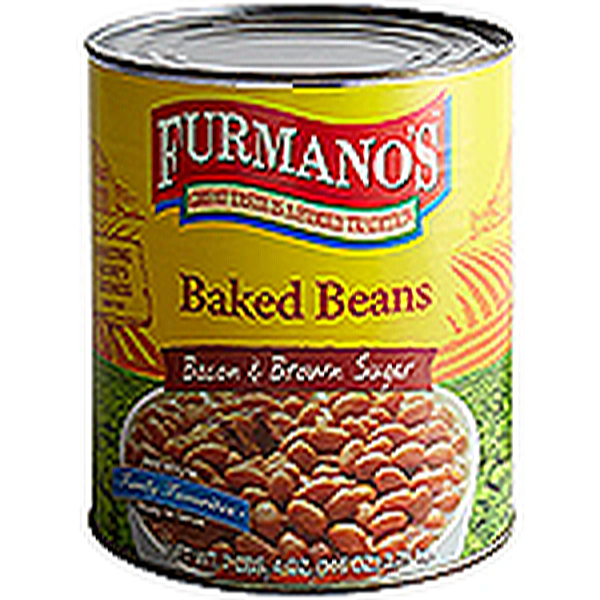

# Flash Fry
Ever wanted to just absolutely ruin an image?

Too much quality?

Not sure what to do with all those pixels???

Man have I got the tool for you. 
   

### Control Image (Nothing run yet)

  

### Run with three iterations
### `python flashfry.py "example_image.png" 3`

  

### Run with ten iterations
### `python flashfry.py "example_image.png" 10`

  

### Run with one hundred iterations
### `python flashfry.py "example_image.png" 100`

  